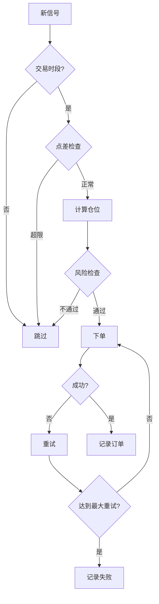

# EA 设计文档

## 概述

本 EA 采用模块化架构，严格分离策略、风控和执行逻辑，确保代码可测试、可维护。

## 架构设计

### 模块分层

```
┌─────────────────────────────────────────┐
│           main.mq4/mq5 (入口)            │
└─────────────────────────────────────────┘
              │
    ┌─────────┼─────────┐
    │         │         │
    ▼         ▼         ▼
┌────────┐┌────────┐┌────────┐
│策略模块││风控模块││执行模块│
│Strategy││  Risk  ││  Exec  │
└────────┘└────────┘└────────┘
    │         │         │
    └─────────┼─────────┘
              ▼
        ┌──────────┐
        │工具模块  │
        │  Utils   │
        └──────────┘
```

### 1. 策略模块 (strategies/)

**职责：** 生成交易信号（纯函数，不依赖终端状态）

- 输入：OHLC 数据、指标值
- 输出：信号类型（BUY/SELL/NONE）、入场价格、止损、止盈
- **要求：** 无重绘、无未来函数

**示例接口：**
```mql4
struct Signal {
    int type;           // 0=NONE, 1=BUY, 2=SELL
    double entry;       // 入场价
    double sl;          // 止损价
    double tp;          // 止盈价
    string reason;      // 信号原因（用于日志）
};

Signal GenerateSignal(string symbol, int timeframe);
```

### 2. 风控模块 (risk/)

**职责：** 仓位计算、风险检查

- 基于账户风险百分比计算手数
- 支持 ATR 或固定点数止损
- 检查最大持仓数、相关性
- 验证止损距离是否符合 broker 要求

**示例接口：**
```mql4
double CalculateLotSize(
    string symbol,
    double sl_distance,  // 止损距离（点数）
    double risk_percent  // 风险百分比
);

bool ValidateRisk(
    string symbol,
    double lot_size,
    double sl_distance
);
```

### 3. 执行模块 (exec/)

**职责：** 订单管理、错误处理

- OrderSend 封装（含重试逻辑）
- 错误码处理（requote、busy、off quotes 等）
- 部分成交处理
- NFA/FIFO 兼容性
- 追踪止损（trailing stop）

**示例接口：**
```mql4
int PlaceOrder(
    int type,
    string symbol,
    double lots,
    double price,
    double sl,
    double tp,
    string comment
);

bool ModifyOrder(int ticket, double new_sl, double new_tp);
```

### 4. 工具模块 (utils/)

**职责：** 通用工具函数

- 时间过滤（交易时段、DST、新闻事件）
- 点值计算（3/5 位小数兼容）
- 点差检查
- 日志记录（分级：DEBUG/INFO/WARNING/ERROR）

## 风险管理

### 仓位计算

使用账户风险百分比：

```
止损金额 = 账户余额 × 风险百分比
手数 = 止损金额 / (止损点数 × 点值 × 合约大小)
```

### 风控限制

| 参数 | 默认值 | 说明 |
|------|--------|------|
| risk_per_trade | 0.5% | 单笔交易最大风险 |
| max_drawdown | 10% | 最大回撤限制 |
| max_spread | 30 points | 点差上限 |
| min_stop_distance | 20 points | 最小止损距离 |

## 指标开发规范

### 禁止重绘

**错误示例（会重绘）：**
```mql4
int start() {
    ArrayResize(buffer, Bars);
    for(int i = 0; i < Bars; i++) {
        buffer[i] = iMA(NULL, 0, 20, 0, MODE_SMA, PRICE_CLOSE, i);
    }
}
```

**正确示例（固定缓冲）：**
```mql4
int start() {
    int counted = IndicatorCounted();
    if(counted < 0) return(-1);
    int limit = Bars - counted - 1;
    
    for(int i = limit; i >= 0; i--) {
        buffer[i] = iMA(NULL, 0, 20, 0, MODE_SMA, PRICE_CLOSE, i);
    }
}
```

### 文档要求

每个自定义指标必须注明：
- 是否使用未来函数
- 是否会重绘
- 计算逻辑说明

## 下单流程



## 日志记录

### 必须记录的事件

1. **订单操作**
   - OrderSend（成功/失败、原因）
   - OrderModify
   - OrderClose

2. **风控事件**
   - 点差超限
   - 风险检查失败
   - 止损距离不足

3. **错误与拒单**
   - Requote
   - Off quotes
   - Trade context busy
   - Broker 拒单

### 日志格式

```
[时间] [级别] [模块] 消息
[2025-11-04 10:30:45] [INFO] [EXEC] Order #12345 opened: BUY 0.1 EURUSD @ 1.0850, SL=1.0800, TP=1.0950
[2025-11-04 10:30:50] [WARNING] [RISK] Spread too high: 35 points > 30 max
[2025-11-04 10:31:00] [ERROR] [EXEC] OrderSend failed: ERR_REQUOTE (138)
```

## 测试策略

### 静态检查
- 运行 `scripts/sanity_checks.py`
- 检查硬编码值、重绘风险、日志完整性

### 单元测试
- 策略模块：使用历史数据测试信号生成
- 风控模块：测试边界条件（零余额、超大止损等）
- 执行模块：模拟错误码

### 回测验证
- 使用 MT4/MT5 Strategy Tester
- 验证风险限制是否生效
- 检查订单日志完整性

## 参数管理

所有参数存储在 `config/params.default.json`，主程序读取后应用。

**禁止：**
- 代码中硬编码风险参数
- 魔术数字（未命名的常量）

**允许：**
- MT4/MT5 EA 输入参数（仅作为界面调整，最终以配置文件为准）

## 兼容性

### Broker 兼容性
- **NFA/FIFO**：需特殊处理（先进先出）
- **点数精度**：兼容 3 位和 5 位小数
- **StopLevel**：动态读取，确保止损距离满足要求

### MT4/MT5 差异
- 订单系统：MT5 使用 position + order 模型
- 函数命名：部分函数在 MT5 中已重命名
- 事件处理：MT5 支持更多事件（OnTrade、OnTimer 等）

## 维护清单

- [ ] 定期检查参数配置是否合理
- [ ] 审查日志，识别异常模式
- [ ] 回测验证策略表现
- [ ] 更新文档（策略变更、新功能）
- [ ] 运行 sanity_checks.py 确保代码质量

